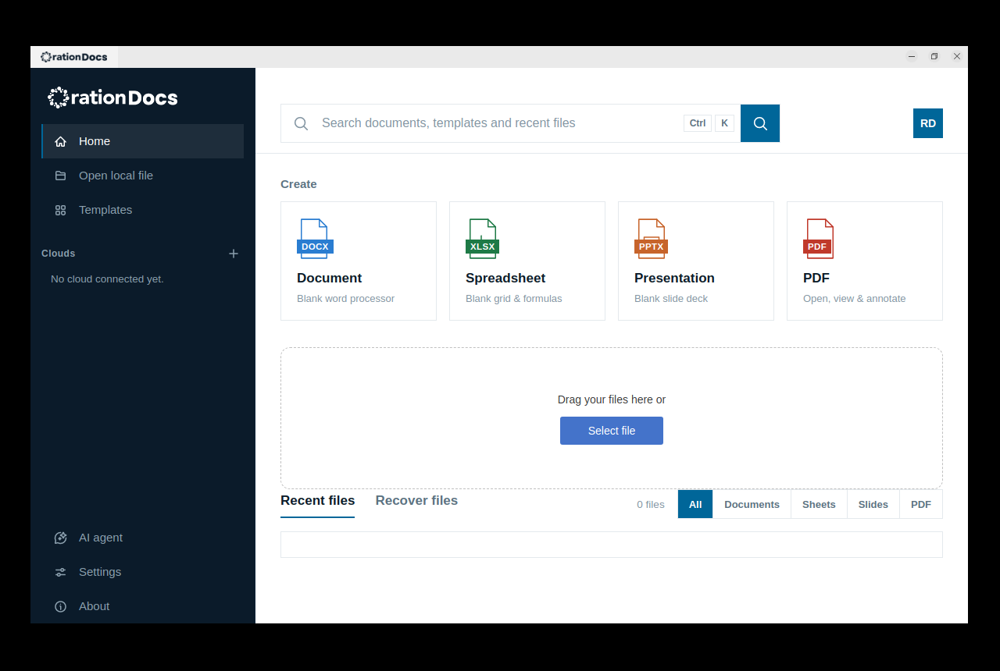

# Ration Docs Desktop

An offline office suite - documents, spreadsheets, presentations and PDFs - that
runs on your own machine and talks to no one unless you ask it to.

Ration Docs is a **modified version of ONLYOFFICE Desktop Editors**, originally
developed by Ascensio System SIA, forked at release 9.4.0 and maintained by
Stackchase Limited. It is not produced by, endorsed by, or affiliated with
Ascensio System SIA.

## Download

Current release: **[2026.1.0](https://github.com/Stackchase-Limited/ration-docs-desktop/releases/tag/v2026.1.0)**

| Platform | File |
|---|---|
| macOS, Apple Silicon | [`RationDocs-2026.1.0-arm64.dmg`](https://github.com/Stackchase-Limited/ration-docs-desktop/releases/download/v2026.1.0/RationDocs-2026.1.0-arm64.dmg) |
| Linux arm64, Debian/Ubuntu | [`ration-docs_2026.1.0-1_arm64.deb`](https://github.com/Stackchase-Limited/ration-docs-desktop/releases/download/v2026.1.0/ration-docs_2026.1.0-1_arm64.deb) |
| Linux arm64, other | [`ration-docs-2026.1.0-1-aarch64.tar.xz`](https://github.com/Stackchase-Limited/ration-docs-desktop/releases/download/v2026.1.0/ration-docs-2026.1.0-1-aarch64.tar.xz) |
| Offline help | [`ration-docs-help-2026.1.0-1-any.tar.xz`](https://github.com/Stackchase-Limited/ration-docs-desktop/releases/download/v2026.1.0/ration-docs-help-2026.1.0-1-any.tar.xz) |

Checksums are published beside the files. **Neither build is signed**: on macOS,
Gatekeeper will refuse the first launch until you clear the quarantine attribute,
and on Linux the packages carry no repository signature. That means you are
trusting the source of the file and nothing else is vouching for it.

    # Linux
    sudo apt install ./ration-docs_2026.1.0-1_arm64.deb

    # macOS, after dragging the app to /Applications
    xattr -dr com.apple.quarantine "/Applications/Ration Docs.app"

`RELEASE_NOTES.md` has the full list of what is in this release, what was verified
and how, and what is known to be broken.

## What is different from upstream

This fork exists to fix things, not to add features. 2026.1.0 carries **84 upstream
issue fixes plus 26 defects found while working on them** - 110 in all, weighted
towards data loss and crashes:

| Repository | Upstream issues | With a test | Found in passing |
|---|---|---|---|
| `sdkjs` | 29 | 18 | 7 |
| `core` | 22 | 13 | 4 |
| `desktop-apps` | 22 | 11 | 4 |
| `desktop-sdk` | 10 | 4 | 7 |
| `web-apps` | 3 | 1 | 1 |
| `build_tools` | 2 | 2 | 3 |

The column sums past 84 because one issue often spans two repositories. 48 of the
84 have a test in `fork-fix-tests/` pinned to the commit before the fix, so it
demonstrably fails without it; the other 36 rest on their commit message, and
`UPSTREAM_TRIAGE.md` says which is which rather than blurring the two. `FIXES.md`
is the registry, generated from git history rather than kept by hand.

Beyond the fixes:

- **Linux arm64 builds**, which took sixteen fixes to the build tooling. Two of
  our own earlier fixes to the Linux application turned out never to have been
  compiled, because macOS builds `desktop-apps/macos` and never touches
  `win-linux/`. `build_tools/ARM64_DESKTOP_BUILD.md` records the bring-up.
- **The product is named as itself** on every platform - window title, settings
  path, URL scheme, single-instance mutex, package name. The mutex mattered most:
  sharing ONLYOFFICE's would have made a machine with both installed treat them as
  one application.
- **Documents record their real producer.** Files saved by this build report
  `Ration Docs/2026.1.0.0` in their properties, not somebody else's name.
- **No calls home to ONLYOFFICE.** The update feed, the help centre link and the
  cloud-signup page have been removed rather than repointed, because we do not run
  those services. The editors still connect to an ONLYOFFICE, Nextcloud or ownCloud
  server that *you* run, if you ask them to.

## Repository layout

The suite is one superproject and six submodules, mirroring upstream's split:

| Submodule | What lives there |
|---|---|
| [`core`](https://github.com/Stackchase-Limited/ration-docs-core) | C++ document core: file formats, conversion (`x2t`), spell engine |
| [`sdkjs`](https://github.com/Stackchase-Limited/ration-docs-sdkjs) | Editor engine in JavaScript: cell, word and slide logic |
| [`web-apps`](https://github.com/Stackchase-Limited/ration-docs-web-apps) | Editor user interface: menus, dialogs, plugin manager |
| [`desktop-apps`](https://github.com/Stackchase-Limited/ration-docs-desktop-apps) | The application shell and start page; macOS and Windows/Linux frontends |
| [`desktop-sdk`](https://github.com/Stackchase-Limited/ration-docs-desktop-sdk) | CEF integration between the shell and the editors |
| [`dictionaries`](https://github.com/Stackchase-Limited/ration-docs-dictionaries) | Spellcheck dictionaries |
| [`build_tools`](https://github.com/Stackchase-Limited/ration-docs-build-tools) | The build: fetches dependencies, compiles, assembles the payload |

    git clone --recursive https://github.com/Stackchase-Limited/ration-docs-desktop.git

## Building

Expect a long first build: it fetches and compiles v8, CEF, ICU, boost and OpenSSL
before it reaches any of our code. Budget 100 GB of disk.

    cd build_tools
    python3 configure.py --module desktop --platform mac_arm64 --qt-dir /opt/homebrew/opt/qt@5
    python3 make.py

On Linux arm64 the same two commands with `--platform linux_arm64 --qt-dir /usr`.

The result lands in `build_tools/out/<platform>/onlyoffice/desktopeditors`. On
Linux, `desktop-apps/package` then produces the deb and tarball; on macOS,
`desktop-apps/macos` is an Xcode project and `appdmg` builds the disk image.

`build_tools/ARM64_DESKTOP_BUILD.md` covers the Linux arm64 path in detail,
including the packages the machine needs and the failures that do not say what
they mean.

## Licence and attribution

Ration Docs is distributed under the **GNU Affero General Public License v3**
together with the additional terms supplied with the original program; both are in
[`LICENSE`](./LICENSE). Illustrations, icon sets and documentation content are
licensed under **CC BY-SA 4.0**.

    Copyright (C) Ascensio System SIA, 2009-2026
    Copyright (C) Stackchase Limited, 2026

Ration Docs is a modified version of ONLYOFFICE Desktop Editors. The original
software was developed by Ascensio System SIA; modifications are by Stackchase
Limited, 2026. **ONLYOFFICE is a trademark of Ascensio System SIA**, used here only
to identify the software this product is based on. No trademark rights are granted
by the licence, and none are claimed.

The corresponding source for any released binary is this repository at the matching
tag, including its submodules - `v2026.1.0` for the current release.
